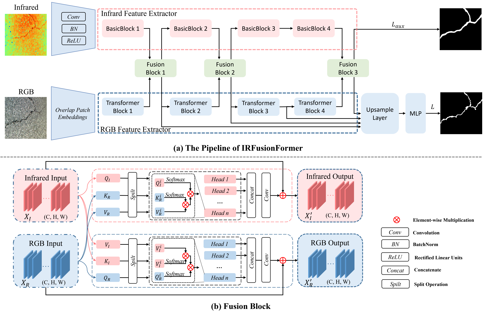

# IRFusionFormer

IRFusionFormer: Enhancing Pavement Crack Segmentation with RGB-T Fusion and Topological-Based Loss

## News

- `2024/10/13`: We release the train and evaluation code.

## A Quick Overview

- **Framework**

- **Visualization**


## Introduction

This is the official repository of IRFusionFormer. We have established a benchmark in the field of pavement crack segmentation using RGB and infrared images, aiming to provide a platform for fair and comprehensive performance comparisons of asphalt pavement crack segmentation algorithms. Currently, the benchmark includes 1 dataset, 9 algorithms, and 6 evaluation metrics, enabling convenient performance comparisons.

Additionally, we present IRFusionFormer, a hybrid encoder-decoder model specifically designed for pavement crack segmentation. This mechanism introduces the Efficient RGB-T Cross Fusion Module (EGTCF), designed to effectively integrate and capture long-range dependencies in RGB and infrared image features across multiple scales using a cross-attention mechanism. For model supervision, a topology-based loss function is combined with an auxiliary loss function derived from infrared image segmentation results, ensuring the final crack segmentation output meets topological constraints. Our framework outperforms state-of-the-art methods across all six evaluation metrics in the benchmark.

## Datasets

The dataset used in this study is an open-source dataset ([Github](https://github.com/lfangyu09/IR-Crack-detection)) dedicated to crack detection using Infrared Thermography (IRT), which is included in the RGB-T asphalt pavement crack segmentation benchmark. It comprises four image types: RGB images, infrared images, fused images (combined at a 50:50 ratio using IR-Fusion™ technology), and ground truth images manually annotated using Photoshop. Each category consists of 448 images, each with a resolution of 640x480 pixels. For training and evaluation purposes, the segmentation model divides the entire dataset into two subsets: 358 images for the training set and 90 images for the test set.

## Models

| Type | Models (Code)          | Dice       | IoU        | Accuracy   | Precision  | Specificity | Recall     |
| ---- | ----------------------- | ---------- | ---------- | ---------- | ---------- | ----------- | ---------- |
| I    | MCNet [2] | 0.6852     | 0.5365     | 0.9589     | 0.6936     | 0.9785      | 0.6914     |
| R    | U-net [3]         | 0.7891     | 0.6517     | 0.9794     | 0.8161     | 0.9909      | 0.7639     |
| R    | UNet++ [4]              | 0.8048     | 0.6733     | 0.9801     | 0.7937     | 0.9887      | 0.8574     |
| R    | DeepLabV3 [5]           | 0.8338     | 0.7149     | 0.9828     | 0.8134     | 0.9896      | 0.8552     |
| R    | DeepCrack [6]           | 0.7406     | 0.5880     | 0.9787     | 0.6592     | 0.9837      | 0.8450     |
| R    | CrackFormer [7]         | 0.8489     | 0.7374     | <u>0.9847</u>   | 0.8462     | 0.9918      | 0.8515     |
| IR   | CRM_RGBTSeg [8]         | 0.8450     | 0.7370     | 0.9829     | 0.8651     | <u>0.9921</u>    | 0.8293     |
| IR   | CMNeXt [9]              | <u>0.8760</u>   | <u>0.7794</u>   | 0.9835     | <u>0.8885</u>   | <u>0.9921</u>    | <u>0.8639</u>   |
| IR   | *IRFusionFormer (ours)* | **0.9001** | **0.8183** | **0.9899** | **0.9001** | **0.9947**  | **0.9001** |

## Quick Start

**Prepare the Dataset and Checkpoints**

[Read the prepare docs](Prepare.md)

**Clone the Repository**

```cmd
https://github.com/sheauhuu/IRFusionFormer.git
cd IRFusionFormer
```

**Installation**

This codebase was developed and tested with the following packages.

OS: Ubuntu 22.04 LTS
CUDA: 12.1
PyTorch: 2.1.0
Python: 3.10.14
Detectron2: 0.6

You can install the dependencies by running the following command:
```cmd
pip install -r requirements.txt
```

!Note:
- To train MCNet model, you need to install [Apex](https://nvidia.github.io/apex/index.html) first.

- To trian CRM model, you need to compile CUDA kernel for MSDeformAttn. If you have trouble, refer [here](https://github.com/facebookresearch/Mask2Former/blob/main/INSTALL.md)

```
cd CRM/models/mask2former/pixel_decoder/ops/
sh make.sh
```

**Training**

- [MCNet](https://github.com/haitaobiyao/MCNet):

  ! Note: You need to install [Apex](https://nvidia.github.io/apex/index.html) first.

  ```cmd
  cd MCNet
  python train.py -d 0
  ```
  
- [DeepCrack](https://github.com/qinnzou/DeepCrack):
  
  ```cmd
  cd DeepCrack
  python train.py
  ```
  
- [CRM_RGBTSeg](https://github.com/UkcheolShin/CRM_RGBTSeg):

  ```cmd
  cd CRM_RGBTSeg
  python train.py \
      --config-file /path/to/config/file \
      --num-gpus 1 \
      --name IRC_CRM
  ```
  
- [CMNeXt](https://github.com/jamycheung/DELIVER):

  ```cmd
  cd CMNeXt
  python tools/train_mm.py --cfg /path/to/config/file
  ```
  
- IRFusionFormer and Other:

  ```cmd
  cd IRFusionFormer
  python train.py --config /path/to/config/file
  ```
  

**Evaluation**

- [MCNet](https://github.com/haitaobiyao/MCNet):

  ```cmd
  cd MCNet
  python eval.py \
      -e MCNet.pth \
      -d 0 \
      --save_path /path/to/save
  ```

- [DeepCrack](https://github.com/qinnzou/DeepCrack):

  ```cmd
  cd DeepCrack
  python test.py
  ```

- [CRM_RGBTSeg](https://github.com/UkcheolShin/CRM_RGBTSeg):

  ```cmd
  cd CRM_RGBTSeg
  python test.py \
  	--config-file  \
      --num-gpus 1 \
  	--name Eval_CRM \
  	--checkpoint /path/to/checkpoint/file
  ```

- [CMNeXt](https://github.com/jamycheung/DELIVER):

  ```cmd
  cd CMNeXt
  python tools/val_mm.py --cfg /path/to/config/file
  ```

- IRFusionFormer and Other:

  ```cmd
  cd IRFusionFormer 
  python test.py --config /path/to/config/file
  ```

## References

[1] Liu, Fangyu and Liu, Jian and Wang, Linbing. "Asphalt pavement crack detection based on convolutional neural network and infrared thermography". *IEEE Transactions on Intelligent Transportation Systems* 23.11 (2022): 22145-22155.

[2] Xiong, Haitao, Wenjie Cai, and Qiong Liu. "MCNet: Multi-level correction network for thermal image semantic segmentation of nighttime driving scene." *Infrared Physics & Technology* 113 (2021): 103628.

[3] Ronneberger, Olaf, Philipp Fischer, and Thomas Brox. "U-net: Convolutional networks for biomedical image segmentation." *Medical image computing and computer-assisted intervention–MICCAI 2015: 18th international conference, Munich, Germany, October 5-9, 2015, proceedings, part III 18*. Springer International Publishing, 2015.

[4] Zhou, Zongwei, et al. "Unet++: Redesigning skip connections to exploit multiscale features in image segmentation." *IEEE transactions on medical imaging* 39.6 (2019): 1856-1867.

[5] Chen, Liang-Chieh, et al. "Encoder-decoder with atrous separable convolution for semantic image segmentation." *Proceedings of the European conference on computer vision (ECCV)*. 2018.

[6] Zou, Qin, et al. "Deepcrack: Learning hierarchical convolutional features for crack detection." *IEEE transactions on image processing* 28.3 (2018): 1498-1512.

[7] Liu, Huajun, et al. "Crackformer network for pavement crack segmentation." *IEEE Transactions on Intelligent Transportation Systems* 24.9 (2023): 9240-9252.

[8] Shin, Ukcheol, et al. "Complementary random masking for rgb-thermal semantic segmentation." *2024 IEEE International Conference on Robotics and Automation (ICRA)*. IEEE, 2024.

[9] Zhang, Jiaming, et al. "CMX: Cross-modal fusion for RGB-X semantic segmentation with transformers." *IEEE Transactions on intelligent transportation systems* (2023).

## Cite

Please cite the following paper if you use our work in your research.

```bibtex
@article{irfusionformer,
  title={IRFusionFormer: Enhancing Pavement Crack Segmentation with RGB-T Fusion and Topological-Based Loss},
  author={Xiao, Ruiqiang and Chen, Xiaohu},
  journal={arXiv preprint arXiv:2409.20474},
  year={2024}
}
```